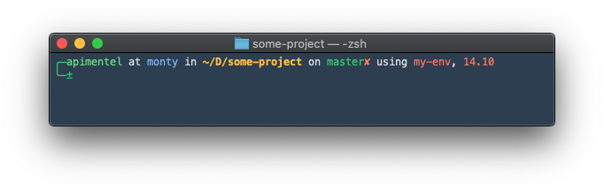

Ale ZSH Theme
=============

This theme is based on the fino theme.

What does it show?
------------------

- User and hostname
- Current working directory
- Current git branch (SHA1 in detached head state)
- Dirtiness of working directory (✔/✘)
- Active virtualenv, ruby version (rvm and rbenv), and node version (nodenv)

Compatibility
-------------
The theme should work with [Oh My Zsh](http://ohmyz.sh) and [Prezto](https://github.com/sorin-ionescu/prezto). If it doesn't, please contact me.

Installation
------------
  1. Clone the repository:

    git clone https://github.com/alepimentel/ale-zsh.git ~/.ale-zsh

  2. Create a symlink to the theme file:

  __If you're using Oh My Zsh__:

  - Run `ln -s ~/.ale-zsh/themes/ale.zsh-theme ~/.ohmyzsh/themes/ale.zsh-theme`.
  - Load the theme in `~/.zshrc`.

  __If you're using Prezto__:

  - Run `ln -s ~/.ale-zsh/ale.zsh-theme ~/.zprezto/modules/prompt/functions/prompt_ale_setup`.
  - Load the theme in `~/.zpreztorc`.

  3. Open a new terminal.

Notes
-----
By default, the hostname is displayed only during an ssh connection (i.e. in a remote server). You can write the hostname (or any name you want) in `~/.box-name` and it will be shown.
